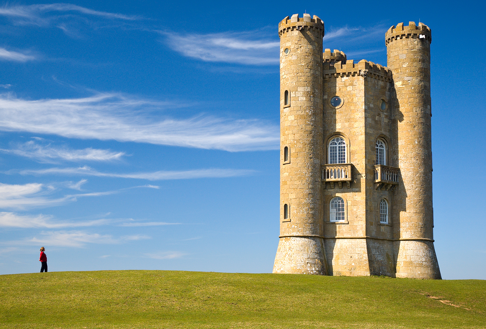

# Seam Carving

###### Miriam Dreyfuss

A program to perform content aware image resizing 

### How it works:

I calculate the "energy" of each pixel in the original image by
calculating how different the color of that paricular pixel is 
from the surrounding pixels. This distinguishes the high importance
elements of the picture from the less important parts.

I use the energies of the pixels to calculate "seams"; ie, lines that
traverse the entire image and calculate the energy of the paths. I choose
the seam with the lowest energy to remove.

I repeat this process as often as necessary to get the image to its
intended size.

(see more detail on [Wikipedia](https://en.wikipedia.org/wiki/Seam_carving))

####Ex: Before and after Seam Carving is applied

Original Image:

Slightly resized:

Very resized:

